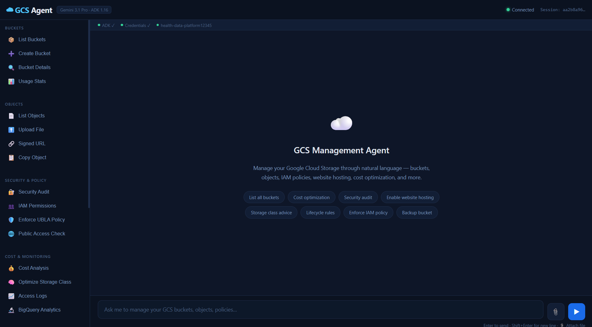

# Building an AI Agent That Manages Google Cloud Storage Through Natural Language

*How I built an 81-tool AI agent using Google ADK and Gemini 2.5 Flash — and exposed it as an MCP server so Claude Code, Gemini CLI, and Cursor can manage GCS buckets, deploy websites, and enforce security policies without writing a single `gsutil` command.*

---

## The Problem

Managing Google Cloud Storage at scale means juggling `gsutil` commands, navigating the console for IAM policies, manually setting lifecycle rules, configuring CORS headers, and remembering the exact syntax for each operation. Even experienced engineers look things up constantly.

I wanted a single interface where I could say:

> "Create a bucket, enable website hosting, upload my HTML, make it public, and give me the URL."

And have the agent handle every GCS API call behind the scenes.

---

## What I Built

**GCS Storage Pilot** is an AI agent that manages Google Cloud Storage entirely through natural language. It is powered by **Google ADK** (Agent Development Kit) and **Gemini 2.5 Flash**, with a **FastAPI** backend serving a real-time chat UI and an **MCP server** that connects the agent's capabilities to any MCP-compatible coding assistant.


*The GCS Agent Console: a real-time chat interface backed by 81 GCS tools. The sidebar groups operations by category — buckets, objects, security, monitoring, website hosting, and advanced operations. Quick-action chips provide one-click access to common tasks.*

---

## 81 Tools, One Agent

The agent has 81 tool functions — each one a direct call to the Google Cloud Storage, BigQuery, or Cloud Monitoring API. Here is the full breakdown:

### Bucket Operations (8 tools)
Create, delete, list, inspect, update configuration, enable/disable versioning, and view usage statistics.

### Object Management (10 tools)
Upload, download, delete, rename, copy, list, get metadata, update metadata, generate signed URLs, and restore previous versions.

### Permissions and IAM (10 tools)
Add/remove bucket members, list permissions, enable/disable public access, get/set bucket policies, get/set IAM policies, and enforce uniform bucket-level access (UBLA).

### Monitoring and Cost Optimization (8 tools)
View metrics, estimate costs, monitor access logs, enable/disable request logging, analyze activity patterns, summarize bucket status, recommend storage classes, and connect to BigQuery for advanced analytics.

### Website Hosting (7 tools)
Enable/disable static hosting, set main page and error page, configure CORS, set cache control headers, and upload website assets.

### Advanced Operations (9 tools)
Add/remove labels, set lifecycle rules, audit access, sync local directories, backup buckets, archive old objects, schedule periodic cleanup, migrate to different regions, and trigger Cloud Functions on events.

### Compliance and Data Protection (8 tools)
Set/get/remove retention policies. Place and release temporary holds. Place and release event-based holds. Set default event-based holds for automatic protection of new objects.

### Encryption (3 tools)
Configure Customer-Managed Encryption Keys (CMEK), inspect encryption settings, and revert to Google-managed encryption.

### Pub/Sub Notifications (3 tools)
Create notifications for bucket events (OBJECT_FINALIZE, OBJECT_DELETE), list configurations, and delete notification subscriptions.

### Soft Delete and Recovery (4 tools)
Enable soft delete with a configurable retention window (1-90 days), disable soft delete, list soft-deleted objects, and restore them by generation number.

### Batch and Scale Operations (4 tools)
Batch delete objects, batch copy by prefix, compose (merge) up to 32 objects into one, and upload large files with resumable upload using configurable chunk size and automatic retry.

### Inventory Reports (2 tools)
Create scheduled inventory reports via the Storage Insights API and list configured report schedules.

---

## Architecture: Why 3 MCP Tools, Not 81

This is the design decision I want to highlight.

The agent exposes only **3 tools** to external AI assistants via MCP (Model Context Protocol):

| MCP Tool | Purpose |
|---|---|
| `gcs_command(instruction)` | Universal gateway — any natural language GCS operation |
| `deploy_website(bucket, index_html)` | Upload HTML/CSS/JS directly to a bucket and return the public URL |
| `enable_website_hosting(bucket)` | Configure a bucket for static website hosting |

The other 78 tools are **internal** — Gemini selects and chains them autonomously based on the natural language instruction.

### Why This Works Better Than Exposing All 81

When a coding assistant like Claude Code needs to manage GCS, it calls `gcs_command("archive objects older than 30 days and notify me via Pub/Sub")`. The request flows through:

```
Claude Code / Cursor / Gemini CLI
    |  calls gcs_command("...")
    v
MCP Server (mcp_server.py)
    |  HTTP POST /api/chat
    v
FastAPI Backend (app.py)
    |  ADK Runner
    v
Gemini 2.5 Flash (agent.py)
    |  selects: set_bucket_lifecycle_rules() + create_bucket_notification()
    v
81 GCS Tool Functions (tools.py)
    |  authenticated API calls
    v
Google Cloud Storage API
```

Gemini is the **GCS domain expert** — it knows which combination of tools to call, in what order, and with what parameters. The coding assistant only needs to express intent in natural language. It never needs to know that `set_bucket_lifecycle_rules` or `create_bucket_notification` exist.

If I had exposed all 81 tools as MCP tools, every coding assistant would need to:
- Choose the right tool from a list of 81
- Know the exact parameters for each
- Chain multi-step operations manually
- Handle errors between steps

That pushes GCS-specific reasoning onto a general-purpose coding LLM. The layered approach keeps each component doing what it is best at.

---

## MCP Integration: One Agent, Every IDE

Because the agent runs as an MCP server, any MCP-compatible client can use it. Start the FastAPI backend once, and the same 3 tools are available everywhere.

### Claude Code
The `.mcp.json` file at the project root is auto-discovered when you open the project:

```json
{
  "mcpServers": {
    "gcs-storage-agent": {
      "command": "python",
      "args": ["bucket_storage_agent/mcp_server.py"],
      "env": { "AGENT_API_URL": "http://localhost:8080" }
    }
  }
}
```

### Gemini CLI
Add the server to `~/.gemini/settings.json`:

```json
{
  "mcpServers": {
    "gcs-storage-agent": {
      "command": "python",
      "args": ["/path/to/gcp-storage-pilot/bucket_storage_agent/mcp_server.py"],
      "env": { "AGENT_API_URL": "http://localhost:8080" }
    }
  }
}
```

### Cursor / Windsurf
Open Settings, go to MCP, and add the same server block. Use absolute paths for the Python executable and the script.

### VS Code (Copilot, Cline, Roo)
Create `.vscode/mcp.json` in the project root:

```json
{
  "servers": {
    "gcs-storage-agent": {
      "type": "stdio",
      "command": "python",
      "args": ["/path/to/gcp-storage-pilot/bucket_storage_agent/mcp_server.py"],
      "env": { "AGENT_API_URL": "http://localhost:8080" }
    }
  }
}
```

---

## Real-World Example: Build and Deploy a Website Using Only Natural Language

Here is a complete workflow where a coding assistant builds a website and deploys it to GCS — entirely through MCP tool calls, without a single `gsutil` command:

**Step 1 — User asks Claude Code:**
> "Build me a simple bio page for Alexis Ngoga, an AI professional with a Master's from CMU, leading AI and Innovation at Evolution Inc. Deploy it to bucket ngogabucketone12345 and make it public."

**Step 2 — Claude Code generates the HTML** (using its own coding ability).

**Step 3 — Claude Code calls the MCP tools:**

```
enable_website_hosting("ngogabucketone12345")
  -> GCS agent configures hosting, IAM, CORS

deploy_website("ngogabucketone12345", "<html>...</html>", "<html>404</html>")
  -> GCS agent uploads index.html and 404.html directly to the bucket

gcs_command("Grant public read access to ngogabucketone12345")
  -> GCS agent adds allUsers as objectViewer
```

**Step 4 — The website is live:**
`https://storage.googleapis.com/ngogabucketone12345/index.html`

The entire operation — from writing the HTML to making it publicly accessible — happens in a single conversation without leaving the IDE. The same workflow works in Gemini CLI, Cursor, and any other MCP-compatible client.

---

## The Storage UI

For users who prefer a visual interface, the project includes a real-time web console built with NestJS and Socket.IO.

The sidebar organizes all 81 capabilities into categories:
- **Buckets** — List, create, inspect, view usage
- **Objects** — List, upload, download, generate signed URLs
- **Security and Policy** — Audit, IAM, UBLA, public access
- **Cost and Monitoring** — Analysis, optimization, access logs, BigQuery
- **Website Hosting** — Enable, configure CORS, upload assets, deploy
- **Advanced** — Backup, archive, lifecycle rules, versioning, migration

Quick-action chips on the welcome screen provide one-click access to common tasks like "List all buckets", "Security audit", "Enable website hosting", and "Backup bucket".

The chat interface supports natural language — users type what they want, and the agent handles the rest. File attachments allow uploading directly from the browser to any GCS bucket without needing a local file path.

---

## Getting Started

### Prerequisites
- Python 3.11+
- A GCP project with the **Cloud Storage API** enabled
- A service account with the **Storage Admin** role
- A Gemini API key (free tier works)

### Setup

```bash
git clone https://github.com/Ngoga-Musagi/gcp-storage-pilot.git
cd gcp-storage-pilot

# Python environment
python -m venv venv
source venv/Scripts/activate        # Windows
# source venv/bin/activate          # Linux/Mac
pip install -r bucket_storage_agent/requirements.txt
```

Create `bucket_storage_agent/.env`:
```env
GOOGLE_CLOUD_PROJECT=your-project-id
GOOGLE_APPLICATION_CREDENTIALS=./service-account-key.json
GOOGLE_GENAI_USE_VERTEXAI=FALSE
GOOGLE_API_KEY=your-gemini-api-key
```

Place your service account JSON key at `bucket_storage_agent/service-account-key.json`.

### Run the Agent

```bash
# Option 1 — FastAPI backend (required for MCP and web UI)
uvicorn bucket_storage_agent.app:app --host 0.0.0.0 --port 8080 --reload

# Option 2 — ADK built-in web UI
adk web bucket_storage_agent

# Option 3 — CLI only
adk run bucket_storage_agent
```

For the full web UI (NestJS frontend), open a second terminal:
```bash
cd storage-ui
npm install
npm run start:dev
# Open http://localhost:3000
```

---

## Tech Stack

| Layer | Technology |
|---|---|
| Agent Framework | Google ADK 1.16 |
| LLM | Gemini 2.5 Flash |
| Backend | FastAPI + Uvicorn |
| Frontend | NestJS 10 + Socket.IO |
| MCP Server | FastMCP (Python, stdio transport) |
| GCP SDKs | google-cloud-storage, google-cloud-monitoring, google-cloud-bigquery |
| Auth | GCP Service Account + Application Default Credentials |

---

## What I Learned

**Tool design matters more than tool count.** 81 tools is a lot, but the agent is only useful because Gemini can select the right combination for any given request. The MCP layer abstracts this completely — external clients never need to know the internal tool inventory.

**MCP is the right integration pattern.** Instead of building separate plugins for Claude Code, Cursor, and Gemini CLI, one MCP server works everywhere. Adding a new client is a 5-line config change.

**The deploy endpoint needed direct SDK calls, not agent routing.** My initial `/api/deploy` endpoint passed HTML content as a chat message to Gemini, which then tried to use `upload_object` (a tool that expects a local file path). Gemini couldn't handle raw string content as a "file". The fix was to upload directly via the GCS SDK in the endpoint — no agent needed for a structured, deterministic operation.

---

## Links

- **Repository:** [github.com/Ngoga-Musagi/gcp-storage-pilot](https://github.com/Ngoga-Musagi/gcp-storage-pilot)
- **Architecture Deep Dive:** [ARCHITECTURE.md](https://github.com/Ngoga-Musagi/gcp-storage-pilot/blob/main/ARCHITECTURE.md)

---

*Built by [Alexis Ngoga](https://github.com/Ngoga-Musagi) — AI and Innovation Lead at Evolution Inc.*
*Google ADK Agents Intensive — Enterprise Agents Track.*
